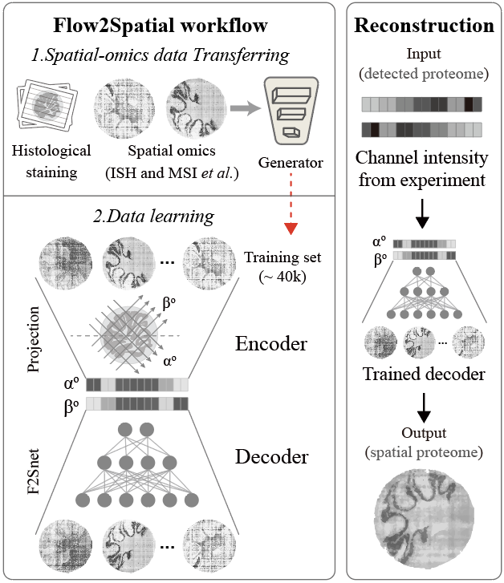

## Flow2Spatial reconstructs spatial proteomics through transfer learning 

Flow2Spatial is the computational part of PLATO (parallel flow projection and transfer learning across omics data). 

It aims to reconstruct spatial proteomics from the values of parallel-flow projections in PLATO. Leveraging transfer learning, Flow2Spatial can restore fine structure of protein spatial distribution in different tissue types. 

  

  Overview of Flow2Spatial.

### Prerequisites 
    "torch", "shapely", "cvxpy", "anndata",
     "scipy", "numpy", "pandas"

Further tutorials please refer to  https://Flow2Spatial.readthedocs.io/. 

### Citation 

Beiyu Hu, Ruiqiao He, Kun Pang, Guibin Wang, et al. High-resolution spatially resolved proteomics of complex tissues based on microfluidics and transfer learning. Cell 188, 1-15 (2025). 
