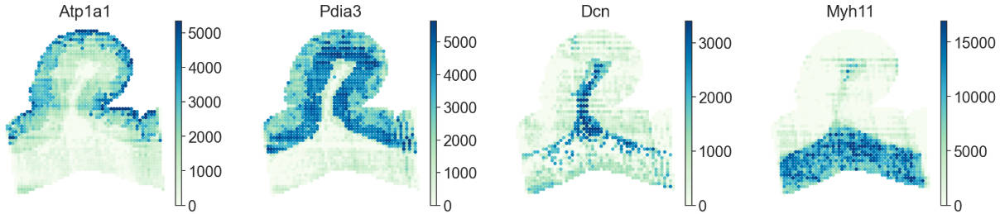

Reconstructing the spatial proteomics of rat large intestinal
----------------------------------------------------------------

To present the pipeline of Flow2Spatial more clearly, we show the rat large intestinal spatial proteomics reconstruction as an instance. 

Here, we applied PLATO to an adult rat large intestinal villus-like tissue using a 25 µm chip. Nearly 2,000 proteins groups in ~100 channels (two angle) was successfully detected using LC-MS/MS, and needed to be reconstructed by Flow2Spatial. After quality control, the channel intensity used for reconstruction is located at https://github.com/bioinfo-biols/Flow2Spatial/tree/main/tests/df_pro_gut.csv.

Reconstruction 
````````````````

With the trained model weights (located at https://github.com/bioinfo-biols/Flow2Spatial/tree/main/tests), we can use ``F2S.model.reconstruction()`` to reconstruct spatial proteomics with the real MS values. 

.. code-block:: python 

    import Flow2Spatial as F2S
    import pandas as pd
    ## Read protein abundance table
    channel_intensity_list_dat = pd.read_csv('./df_pro_gut.csv')
    channel_intensity_list_dat.loc[channel_intensity_list_dat['PG.Genes'].isna(), 'PG.Genes'] = channel_intensity_list_dat.loc[channel_intensity_list_dat['PG.Genes'].isna(), 'PG.ProteinAccessions'] + '_gene'
    channel_intensity_list_dat_dropna = channel_intensity_list_dat.dropna()

    ## Prediction
    Reconstruction = F2S.model.reconstruction(channel_intensity_list_dat_dropna, DNN_model='./Recontruct_weights_gut.pkl', Xchannels=57, mask='./mask')

Corresponding channel_intensity, DNN_model and mask locate at https://github.com/bioinfo-biols/Flow2Spatial/tree/main/tests. We can reconstruct protein spatial distribution with these files. 

**TroubleShooting:** This step requires an internet connection for the first run. For non-networked servers, you can upload the required files (located in https://github.com/bioinfo-biols/Flow2Spatial/tree/main/Flow2Spatial/model/resnet34-b627a593.pth) to the *model* folder under the Flow2Spatial installation path. 

In default, an AnnData object would be saved at "./save_environ/adata.h5ad" (located at https://github.com/bioinfo-biols/Flow2Spatial/tree/main/tests/adata.h5ad). You are welcome to use h5ad readers, such as ``sc.read_h5ad('save_environ/adata.h5ad')`` in scanpy, for further spatial proteomics analysis. 

.. code-block:: python

    ## For example
    import scanpy as sc
    import seaborn as sns
    sns.set(style="ticks", font_scale=2)
    adata = sc.read_h5ad('./save_environ/adata.h5ad')
    sc.pl.spatial(adata, color=['Atp1a1', 'Pdia3', 'Dcn', 'Myh11'], spot_size=1.2, cmap='GnBu', vmax='p99', wspace=0., frameon=False, show=False)



